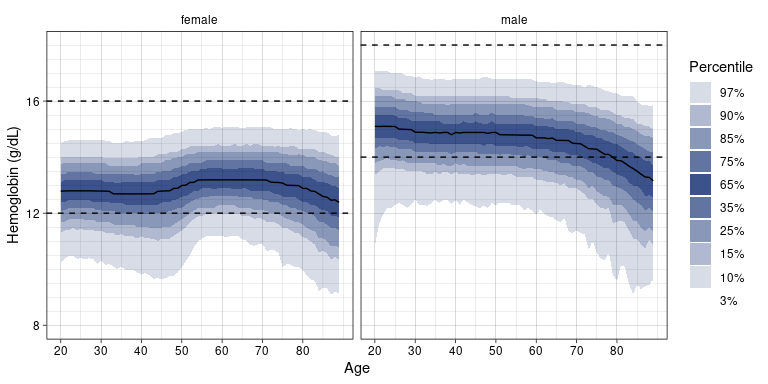

<!-- README.md is generated from README.Rmd. Please edit that file -->

# labNorm

<!-- badges: start -->

[](https://lifecycle.r-lib.org/articles/stages.html#experimental)
[](https://CRAN.R-project.org/package=labNorm)
<!-- badges: end -->

`labNorm` provides functions for normalizing standard laboratory
measurements (e.g. hemoglobin, cholesterol levels) according to age and
gender. These normalizations are based on the algorithms described in
the research paper [“Personalized lab test models to quantify disease
potentials in healthy
individuals”](https://doi.org/10.1038/s41591-021-01468-6).

This package allows users to easily obtain normalized values for their
lab results and to project them on the population distribution. For more
information go to: <https://tanaylab.weizmann.ac.il/labs/>

## Installation

You can install the development version of `labNorm` from GitHub using
the `remotes` package:

``` r
retmotes::install_github("tanaylab/labNorm")
```

## Example

Normalize hemoglobin values for a group of subjects:

``` r
library(labNorm)

# Add a column for the normalized values
hemoglobin_data$quantile <- ln_normalize(
    hemoglobin_data$value,
    hemoglobin_data$age,
    hemoglobin_data$sex,
    "Hemoglobin"
)
#> → Using default quantiles. For higher resolution quantiles, run `ln_download_data()`. This message will only be shown once per session.

head(hemoglobin_data)
#>   age  sex  value  quantile
#> 1  20 male  5.590 0.0232022
#> 2  20 male 14.210 0.2289049
#> 3  20 male 14.600 0.3279873
#> 4  20 male 14.975 0.4478623
#> 5  20 male 15.100 0.5007307
#> 6  20 male 15.155 0.5155682
```

Plot the quantiles vs values for age 50-60:

``` r
library(ggplot2)
library(dplyr)
#> 
#> Attaching package: 'dplyr'
#> The following objects are masked from 'package:stats':
#> 
#>     filter, lag
#> The following objects are masked from 'package:base':
#> 
#>     intersect, setdiff, setequal, union

hemoglobin_data %>%
    filter(age >= 50 & age <= 60) %>%
    ggplot(aes(x = value, y = quantile, color = sex)) +
    geom_point() +
    theme_classic()
```


Plot the age/sex distribution of Hemoglobin:

``` r
ln_plot_dist("Hemoglobin")
```


